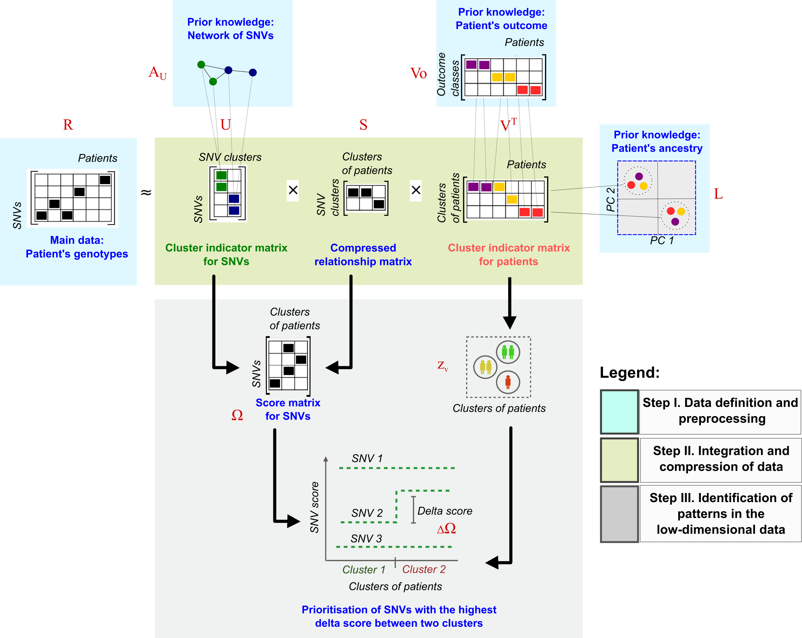

----

## Overview  


By default, images are displayed left-aligned. 

**Resize** an image using HTML tags (side note: check out [RStudio's R Markdown Cheatsheet](https://www.rstudio.com/resources/cheatsheets/)):




---- 

## `R` code


#### `R` script


```{r source gdp script, echo=T, warning=FALSE, message=F}
## source an external script 
source("advanced/my_script.R")

## use the calc_gdp() function `my_script.R`
my_data <- calc_gdp(my_country <- 'Slovenia')


```

<br>


